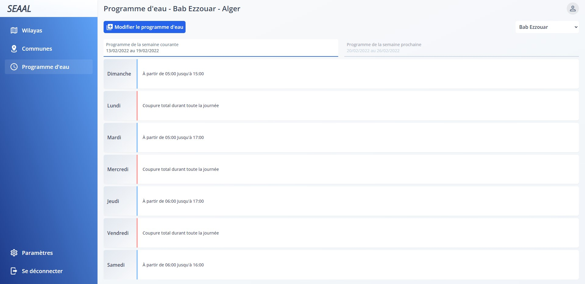
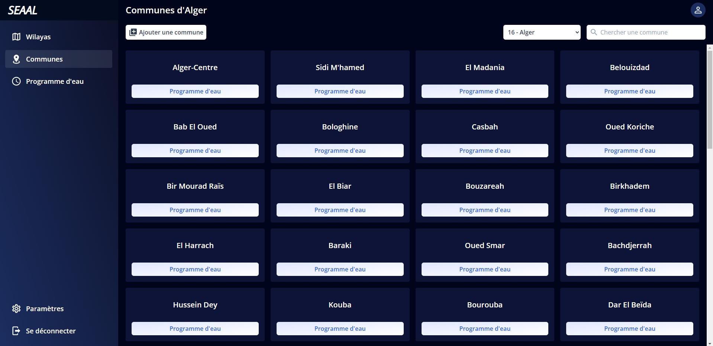

# Water Schedule Administration

  

This app is an admin panel that gives the ability to set and manage the water schedule for all the Algerian wilayas (districts) and their respective towns. The app was created as a result of the water crysis that resulted in the cease of continuous 24h/7d water availability in my country. It permits to manage the water schedule by setting the time of water supply cutting and restoration of both current and next week. It then exposes the schedules data to a public api that is accessed through the Android/iOS app which is a related project available in this [repository](https://github.com/medcheck/water-schedule-app).

## info

Backend api is written in PHP using **Laravel**.

Frontend is an SPA written in typescript using **Vuejs** (with vuex for state management) and **Tailwind** as a css framework.

Other features:  

- Api caching.
- Ratelimiting
- Lazy loaded routes and translations.
- Fully responsive.
- Multiple themes & languages
- And more...

  

## Disclaimer

The SEAAL (Société des Eaux et de l’Assainissement d’Alger) brand name is for demonstration purpose. This app is in no way endoresed by SEAAL or related to them.

## License

The app is released under the [LGPL-3.0 license](https://opensource.org/licenses/LGPL-3.0).
